# LessonForge

An AI-powered, multi-agent platform for generating **standards-aligned, differentiated, assessable, and export-ready lesson plans** from natural-language teacher requirements.

The system combines **Next.js**, **FastAPI**, **LangGraph**, structured LLM outputs, and **hybrid RAG** to move from teacher intent to a validated lesson plan while exposing the agent workflow in real time.

---

## Table of Contents

- [1. Vision](#1-vision)
- [2. Problem](#2-problem)
- [3. Solution](#3-solution)
- [4. Core Design Principles](#4-core-design-principles)
- [5. End-to-End Architecture](#5-end-to-end-architecture)
- [6. Agent Graph](#6-agent-graph)
- [7. Request Lifecycle](#7-request-lifecycle)
- [8. Agent Responsibilities](#8-agent-responsibilities)
- [9. Shared Graph State](#9-shared-graph-state)
- [10. Hybrid RAG Architecture](#10-hybrid-rag-architecture)
- [11. Reflection and Quality Loop](#11-reflection-and-quality-loop)
- [12. Real-Time Streaming](#12-real-time-streaming)
- [13. Data and Persistence](#13-data-and-persistence)
- [14. Export Pipeline](#14-export-pipeline)
- [15. API Boundary](#15-api-boundary)
- [16. Security and Reliability](#16-security-and-reliability)
- [17. Observability](#17-observability)
- [18. Deployment Architecture](#18-deployment-architecture)
- [19. Suggested Technology Stack](#19-suggested-technology-stack)
- [20. Example Input](#20-example-input)
- [21. Example Output Contract](#21-example-output-contract)
- [22. Future Extensions](#22-future-extensions)
- [23. Getting Started](#23-getting-started)

---

# 1. Vision

The goal is to build a **production-grade agentic lesson planning assistant** that behaves less like a text generator and more like a collaborative instructional design team.

A teacher should be able to provide:

> "Create a 60-minute Grade 5 science lesson on Earth's systems using inquiry-based learning, aligned with NGSS, with support for ELL learners and an extension for gifted students."

The system should then:

1. Understand the instructional requirements.
2. Retrieve authoritative curriculum and standards information.
3. Design the instructional structure.
4. Add differentiation strategies.
5. Design assessments and success criteria.
6. Critically review the entire lesson.
7. Automatically repair identified problems.
8. Validate the final structure.
9. Save the lesson.
10. Export it into teacher-friendly formats.

The teacher should also be able to **watch the process happen in real time**.

---

# 2. Problem

Traditional AI lesson-plan generation has several weaknesses:

- It can hallucinate curriculum standards.
- It often produces generic lesson plans.
- Timing constraints may not add up.
- Assessments may not measure the stated learning objectives.
- Differentiation is frequently superficial.
- Output formats are inconsistent.
- Teachers have limited visibility into why an answer was generated.
- Large prompts become difficult to maintain as requirements grow.
- A single LLM call makes validation and iterative correction difficult.

The platform addresses these problems by separating responsibilities across specialized agents and introducing **retrieval, structured state, deterministic validation, and reflection loops**.

---

# 3. Solution

The proposed architecture consists of five major layers:

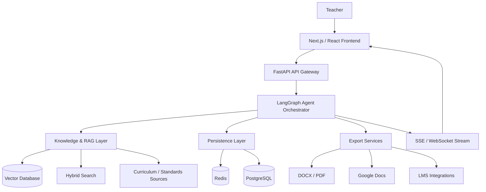

The most important architectural decision is that **LangGraph owns the lesson-generation workflow**, while FastAPI remains the application/API boundary.

---

# 4. Core Design Principles

## 4.1 Structured state over conversational memory

The lesson plan should exist as a strongly typed state object rather than a growing conversation transcript.

## 4.2 Specialized agents over one giant prompt

Each agent should have one primary responsibility and a well-defined input/output contract.

## 4.3 Retrieval before generation

Standards, curriculum requirements, and other authoritative information should be retrieved before agents make claims about them.

## 4.4 Structured outputs over Markdown parsing

Agents should produce JSON/Pydantic-compatible structures wherever possible.

## 4.5 Deterministic validation + LLM critique

Not every quality rule should be delegated to an LLM.

For example:

- Total duration = 60 minutes → deterministic validation.
- Required sections exist → deterministic validation.
- Standard code exists in retrieved evidence → deterministic validation.
- Instructional quality → LLM critic.

## 4.6 Observable agent execution

Every important state transition should be observable through an event stream.

## 4.7 Human control

The generated plan should be editable and regeneratable. The system should assist the teacher rather than silently replace teacher judgment.

---

# 5. End-to-End Architecture

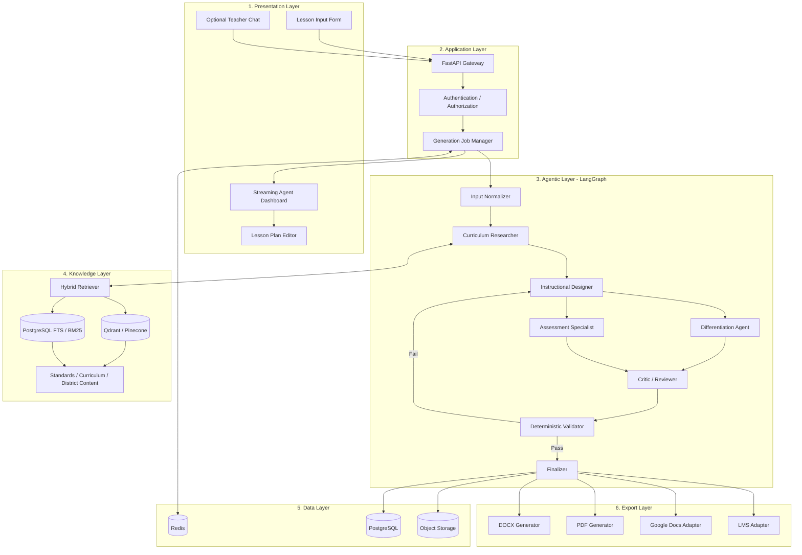

---

# 6. Agent Graph

The core workflow is intentionally **not purely linear**.

The researcher establishes evidence first. The designer creates the instructional structure. Differentiation and assessment work from the shared lesson state. The critic identifies weaknesses, and failed validation sends the workflow back for correction.

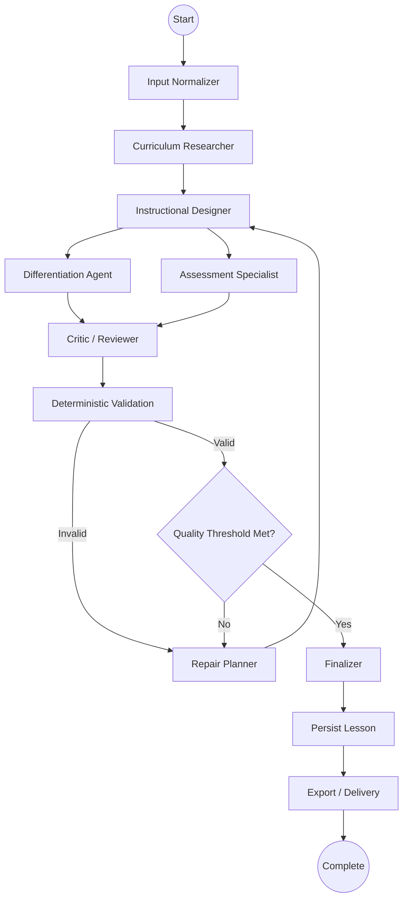

## Why the graph is iterative

A lesson can be structurally valid but pedagogically weak.

For example:

- The lesson is 60 minutes.
- All required fields exist.
- The standards code is valid.
- But the assessment does not measure the objective.

The critic can identify this problem and force another generation cycle.

---

# 7. Request Lifecycle

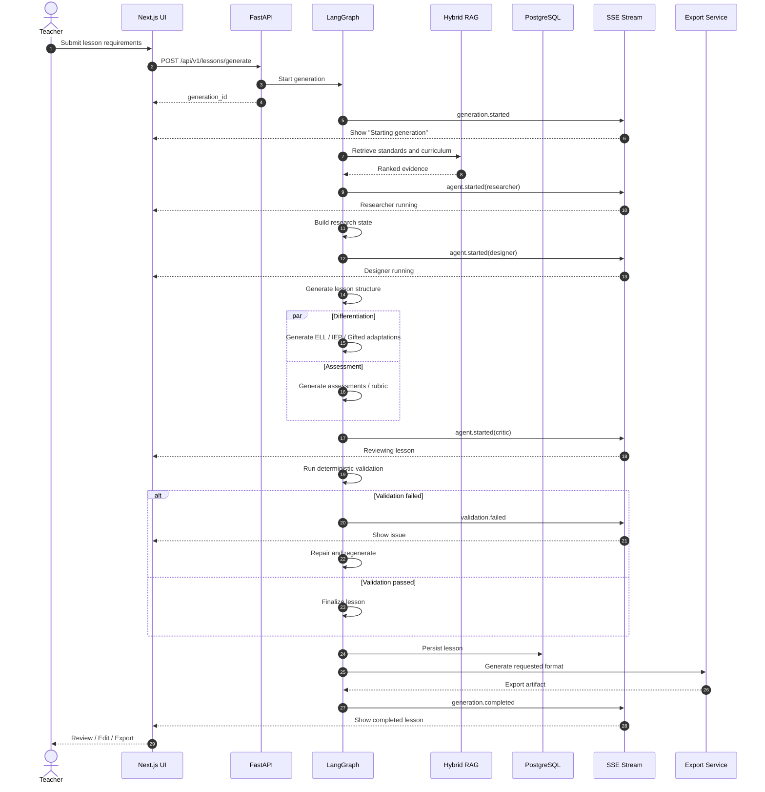

---

# 8. Agent Responsibilities

## 8.1 Input Normalizer

Converts free-form teacher input into a canonical request.

### Responsibilities

- Normalize grade level.
- Normalize subject.
- Parse duration.
- Extract standards.
- Identify instructional strategy.
- Identify differentiation requirements.
- Identify assessment requirements.
- Detect missing information.

### Example

```json
{
  "grade": 5,
  "subject": "science",
  "duration_minutes": 60,
  "topic": "Earth systems",
  "standards_framework": "NGSS",
  "instructional_strategy": "inquiry",
  "learner_profiles": ["ELL", "gifted"]
}
```

---

## 8.2 Curriculum Researcher

The researcher should be the primary agent responsible for **external factual grounding**.

### Tools

- Hybrid RAG
- Standards database
- Curriculum documents
- Approved web search
- District-specific content

### Output

```json
{
  "standards": [],
  "learning_requirements": [],
  "evidence": [],
  "citations": []
}
```

The researcher should never invent a standard when authoritative evidence is unavailable.

---

## 8.3 Instructional Designer

Builds the core lesson structure.

### Responsibilities

- Learning objectives.
- Opening / hook.
- Explicit instruction.
- Guided practice.
- Inquiry / activity.
- Independent practice.
- Closure.
- Materials.
- Teacher actions.
- Student actions.
- Timing.

The output should be structured data rather than arbitrary Markdown.

---

## 8.4 Differentiation Agent

Adds adaptations based on learner needs.

Potential profiles:

- ELL
- IEP / learning support
- Advanced / gifted
- Struggling learners
- Early finishers
- Accessibility requirements

Differentiation should modify the instructional experience rather than merely append a generic paragraph.

---

## 8.5 Assessment Specialist

Creates:

- Formative assessments.
- Checks for understanding.
- Exit tickets.
- Performance tasks.
- Rubrics.
- Success criteria.

The assessment agent should verify alignment between:

```text
Objective → Activity → Evidence of Learning → Assessment
```

---

## 8.6 Critic / Reviewer

The critic acts as an independent quality gate.

It should inspect:

- Standards alignment.
- Objective quality.
- Instructional coherence.
- Timing.
- Differentiation.
- Assessment alignment.
- Age appropriateness.
- Evidence grounding.
- Completeness.
- Teacher usability.

The critic should produce structured findings:

```json
{
  "review_passed": false,
  "score": 0.78,
  "issues": [
    {
      "severity": "high",
      "field": "assessment",
      "issue": "Exit ticket does not measure objective 2",
      "recommendation": "Add an item requiring students to explain..."
    }
  ]
}
```

---

## 8.7 Deterministic Validator

Rules that can be computed should be validated without an LLM.

Examples:

```text
sum(activity.duration_minutes) == lesson.duration_minutes

all(required_sections_present)

all(objectives_have_assessments)

all(standards_are_known)

all(referenced_evidence_exists)
```

This reduces unnecessary LLM calls and makes the system easier to test.

---

# 9. Shared Graph State

LangGraph should maintain a canonical state object.

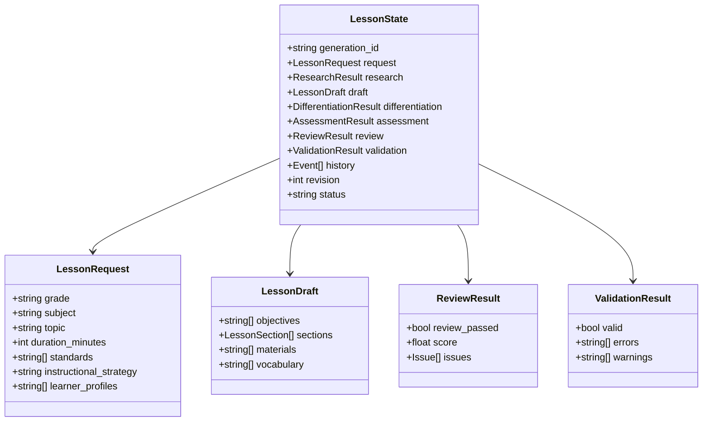

---

# 10. Hybrid RAG Architecture

A lesson-planning system benefits from both **semantic retrieval** and **exact keyword retrieval**.

## Dense retrieval

Useful for questions such as:

> "What concepts should Grade 5 students understand about Earth's systems?"

Use:

- Qdrant
- Pinecone
- pgvector

## Sparse retrieval

Useful for exact identifiers:

> "CCSS.ELA-LITERACY.RL.5.1"

Use:

- PostgreSQL Full Text Search
- BM25
- Elasticsearch / OpenSearch

## Hybrid retrieval

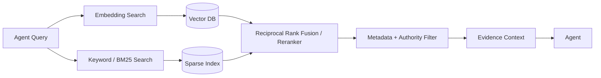

### Recommended metadata

Every indexed document should contain metadata such as:

```json
{
  "source": "NGSS",
  "framework": "NGSS",
  "grade": "5",
  "subject": "science",
  "jurisdiction": "US",
  "document_version": "2026",
  "authority_level": "official",
  "section": "Performance Expectations"
}
```

This enables filtering before generation.

---

# 11. Reflection and Quality Loop

The reflection loop is the primary mechanism for improving generation quality.

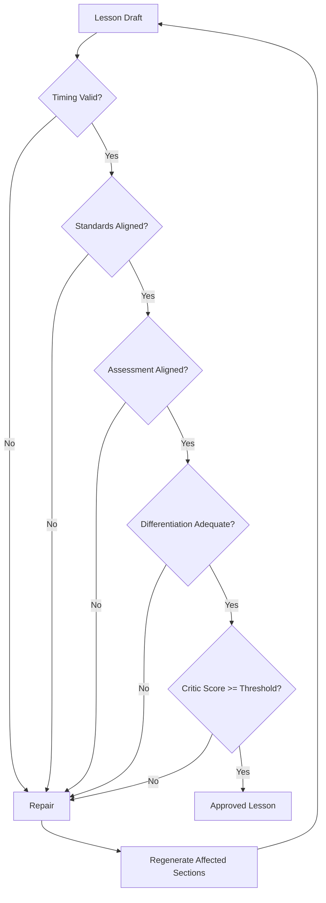

## Example

Input:

```text
Duration: 60 minutes
```

Generated lesson:

```text
Introduction: 10 minutes
Mini lesson: 20 minutes
Investigation: 30 minutes
Independent practice: 20 minutes
Closure: 10 minutes
```

Total:

```text
90 minutes
```

The deterministic validator catches this immediately.

The system should then avoid regenerating the entire lesson if possible. Instead, it should identify the affected sections and ask the designer to repair the schedule.

---

# 12. Real-Time Streaming

The frontend should not wait for the entire generation process.

Recommended event stream:

```text
generation.started
agent.started
agent.progress
retrieval.started
retrieval.completed
agent.completed
validation.started
validation.failed
repair.started
repair.completed
generation.completed
generation.failed
```

Example event:

```json
{
  "event": "agent.progress",
  "generation_id": "gen_123",
  "agent": "curriculum_researcher",
  "message": "Searching official standards...",
  "progress": 35
}
```

## SSE vs WebSocket

For the initial implementation, **SSE is recommended** because the dominant communication pattern is:

```text
Server → Browser
```

WebSockets become more attractive when the application requires:

- Bidirectional agent interaction.
- Live collaborative editing.
- Interrupt / resume controls.
- Interactive agent conversations.

---

# 13. Data and Persistence

## PostgreSQL

Recommended as the primary relational database.

Suggested entities:

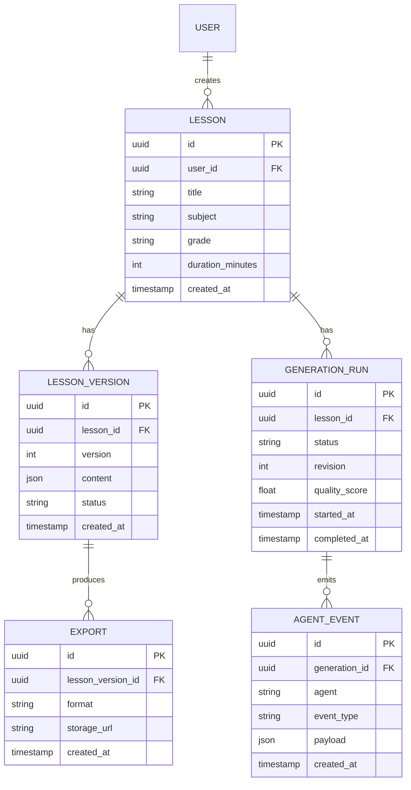

## Redis

Redis can be used for:

- Active generation state.
- Event streams.
- Short-lived caches.
- Rate limiting.
- Job coordination.

## Object Storage

Use object storage for:

- Generated DOCX.
- Generated PDF.
- Uploaded curriculum documents.
- Large artifacts.

---

# 14. Export Pipeline

The canonical lesson should remain **structured JSON** internally.

Markdown, DOCX, PDF, and LMS formats should be treated as presentation/export formats.

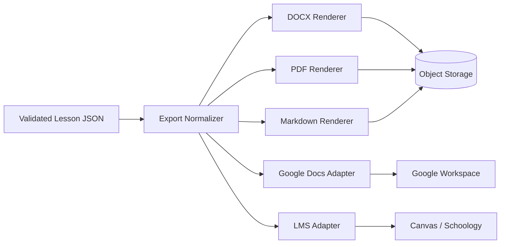

This prevents the application from depending on a Markdown parser to reconstruct lesson structure.

---

# 15. API Boundary

Suggested API design:

## Generate lesson

```http
POST /api/v1/lessons/generate
```

Request:

```json
{
  "grade": "5",
  "subject": "science",
  "topic": "Earth systems",
  "duration_minutes": 60,
  "standards": ["NGSS"],
  "instructional_strategy": "inquiry",
  "learner_profiles": ["ELL", "gifted"]
}
```

Response:

```json
{
  "generation_id": "gen_01J...",
  "status": "queued"
}
```

## Generation status

```http
GET /api/v1/generations/{generation_id}
```

## Event stream

```http
GET /api/v1/generations/{generation_id}/events
```

## Get lesson

```http
GET /api/v1/lessons/{lesson_id}
```

## Update lesson

```http
PATCH /api/v1/lessons/{lesson_id}
```

## Regenerate section

```http
POST /api/v1/lessons/{lesson_id}/sections/{section_id}/regenerate
```

## Export

```http
POST /api/v1/lessons/{lesson_id}/exports
```

---

# 16. Security and Reliability

## Authentication

Use token-based authentication such as:

- OAuth2 / OIDC.
- JWT access tokens.
- Secure session cookies where appropriate.

## Authorization

Every lesson should belong to an owner or organization.

```text
User → Organization → Lesson
```

Never trust a lesson ID supplied by the client without checking ownership.

## Prompt injection protection

RAG documents and external sources must be treated as **untrusted content**.

The system should distinguish:

```text
SYSTEM INSTRUCTIONS
        ↓
AGENT POLICY
        ↓
USER REQUIREMENTS
        ↓
RETRIEVED EVIDENCE
```

Retrieved documents should never be allowed to redefine agent instructions.

## Rate limiting

Generation is expensive.

Apply limits at:

- User level.
- Organization level.
- API endpoint level.
- Model/provider level.

## Idempotency

Generation requests should support an idempotency key to prevent duplicate jobs when users retry requests.

---

# 17. Observability

Agentic systems require more than traditional API logs.

Track:

```text
generation_id
trace_id
agent_name
node_name
model
model_version
prompt_version
input_tokens
output_tokens
latency
retrieval_count
retrieval_latency
validation_errors
revision_count
final_quality_score
estimated_cost
```

## Recommended stack

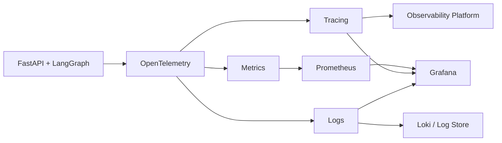

A particularly important metric is:

```text
Average revisions per successful generation
```

If this becomes high, the system is likely generating poor drafts or using weak validation criteria.

---

# 18. Deployment Architecture

A production deployment can separate the synchronous API from the generation workers.

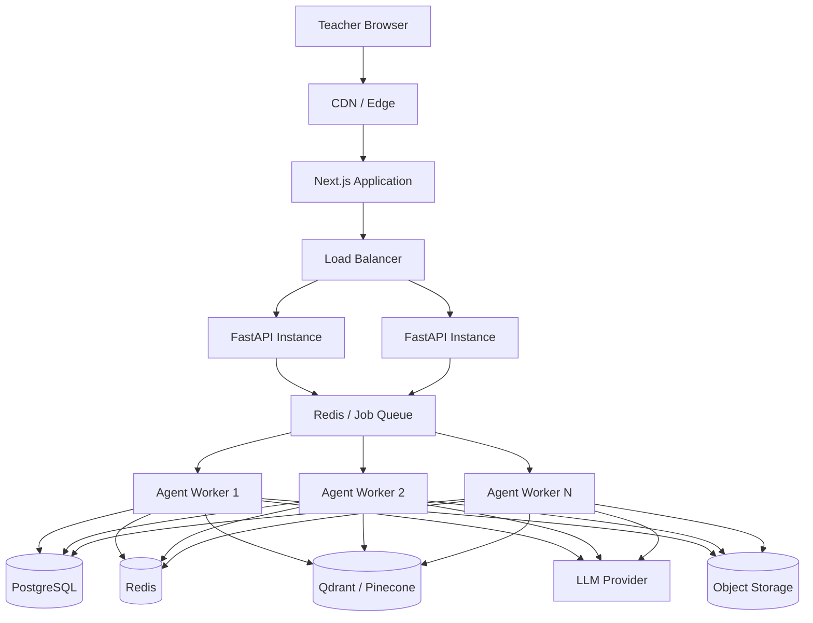

### Important architectural distinction

Do not make the FastAPI request itself perform a long-running generation.

Prefer:

```text
HTTP Request
    ↓
Create Generation Job
    ↓
Return generation_id
    ↓
Worker executes LangGraph
    ↓
SSE streams progress
```

This makes the system resilient to:

- Slow model responses.
- Multiple concurrent users.
- Retries.
- Worker failures.
- Long-running exports.

---

# 19. Suggested Technology Stack

| Layer | Recommended Technology |
|---|---|
| Frontend | Next.js + React + TypeScript |
| UI | Tailwind CSS + component library |
| API | FastAPI |
| Agent Orchestration | LangGraph |
| LLM | OpenAI / Anthropic / configurable provider |
| Structured Output | Pydantic |
| Embeddings | Provider-specific embedding model |
| Vector DB | Qdrant or Pinecone |
| Sparse Search | PostgreSQL FTS / BM25 |
| Primary DB | PostgreSQL |
| Cache / Queue | Redis |
| Background Workers | Celery, ARQ, or dedicated async workers |
| Object Storage | S3-compatible storage |
| Streaming | SSE initially |
| Documents | python-docx + reportlab |
| Auth | OAuth2 / OIDC |
| Observability | OpenTelemetry + Prometheus + Grafana |
| Deployment | Docker + Kubernetes or managed containers |

---

# 20. Example Input

```json
{
  "grade": "5",
  "subject": "Science",
  "topic": "Earth Systems",
  "duration_minutes": 60,
  "standards": [
    "NGSS"
  ],
  "instructional_strategy": "Inquiry-based learning",
  "learner_profiles": [
    "ELL",
    "Gifted"
  ],
  "assessment_type": "Formative + Exit Ticket"
}
```

The system converts this into a structured generation request and launches the agent graph.

---

# 21. Example Output Contract

A lesson should ultimately be represented as structured JSON similar to:

```json
{
  "title": "Investigating Earth's Systems",
  "grade": "5",
  "subject": "Science",
  "duration_minutes": 60,
  "standards": [
    {
      "code": "STANDARD-CODE",
      "description": "Standard description",
      "evidence": []
    }
  ],
  "objectives": [
    {
      "id": "obj-1",
      "text": "Students will...",
      "assessment_ids": ["assessment-1"]
    }
  ],
  "sections": [
    {
      "id": "hook",
      "title": "Engage",
      "duration_minutes": 5,
      "teacher_actions": [],
      "student_actions": [],
      "materials": []
    }
  ],
  "differentiation": {
    "ell": [],
    "iep": [],
    "gifted": []
  },
  "assessments": [
    {
      "id": "assessment-1",
      "type": "exit_ticket",
      "questions": [],
      "success_criteria": []
    }
  ],
  "review": {
    "score": 0.94,
    "passed": true,
    "issues": []
  }
}
```

The exact schema should be implemented with Pydantic models and versioned as the product evolves.

---

# 22. Future Extensions

## 22.1 Teacher-in-the-loop generation

Allow the teacher to intervene during generation:

```text
"Make the investigation more hands-on."
"Reduce the vocabulary load."
"Replace the group activity."
```

The graph should resume from the affected node rather than restarting the entire workflow.

## 22.2 Multi-language lesson generation

Support:

- English.
- Spanish.
- French.
- Arabic.
- Other supported languages.

The lesson structure should remain language-independent.

## 22.3 School / district customization

Organizations could configure:

- Approved standards.
- Preferred lesson template.
- Required sections.
- Assessment policies.
- Approved resources.
- Accessibility requirements.

## 22.4 Lesson quality analytics

Track:

```text
Generation success rate
Average generation latency
Average revision count
Critic score
Teacher acceptance rate
Teacher edit rate
Most frequently repaired section
Most frequently rejected standard
```

## 22.5 Continuous evaluation

Build an evaluation dataset containing representative lesson requests and expected quality criteria.

Every prompt/model/agent change should run against this dataset before production release.

---

# 23. Getting Started

## Suggested repository structure

```text
agentic-lesson-plan-generator/
├── apps/
│   ├── web/
│   │   ├── app/
│   │   ├── components/
│   │   ├── hooks/
│   │   └── lib/
│   │
│   └── api/
│       ├── app/
│       │   ├── api/
│       │   ├── agents/
│       │   ├── graph/
│       │   ├── models/
│       │   ├── schemas/
│       │   ├── services/
│       │   └── workers/
│       └── tests/
│
├── packages/
│   ├── schemas/
│   ├── ui/
│   └── config/
│
├── knowledge/
│   ├── ingestion/
│   ├── chunking/
│   ├── embeddings/
│   └── retrieval/
│
├── exports/
│   ├── docx/
│   ├── pdf/
│   └── lms/
│
├── evals/
│   ├── datasets/
│   ├── graders/
│   └── scenarios/
│
├── infra/
│   ├── docker/
│   ├── kubernetes/
│   └── terraform/
│
├── docs/
│   ├── architecture/
│   ├── api/
│   └── decisions/
│
└── README.md
```

## Recommended implementation order

### Phase 1 — Foundation

- [ ] Create Next.js frontend.
- [ ] Create FastAPI service.
- [ ] Define Pydantic lesson schemas.
- [ ] Set up PostgreSQL.
- [ ] Set up Redis.
- [ ] Implement authentication.

### Phase 2 — Agentic MVP

- [ ] Implement LangGraph state.
- [ ] Implement Input Normalizer.
- [ ] Implement Curriculum Researcher.
- [ ] Implement Instructional Designer.
- [ ] Implement Assessment Specialist.
- [ ] Implement Differentiation Agent.
- [ ] Implement Critic.
- [ ] Implement deterministic validation.
- [ ] Implement repair loop.

### Phase 3 — RAG

- [ ] Build document ingestion pipeline.
- [ ] Chunk curriculum documents.
- [ ] Generate embeddings.
- [ ] Index documents.
- [ ] Implement hybrid retrieval.
- [ ] Add source metadata and citations.
- [ ] Add authority filtering.

### Phase 4 — Product Experience

- [ ] Build live generation dashboard.
- [ ] Implement SSE.
- [ ] Build lesson editor.
- [ ] Add regeneration by section.
- [ ] Add lesson versioning.
- [ ] Add export functionality.

### Phase 5 — Production Hardening

- [ ] Add distributed workers.
- [ ] Add OpenTelemetry tracing.
- [ ] Add Prometheus metrics.
- [ ] Add automated evaluation suite.
- [ ] Add rate limiting.
- [ ] Add retry / recovery logic.
- [ ] Add prompt and schema versioning.
- [ ] Add cost monitoring.
- [ ] Add security testing.

---

# Architecture Summary

The most important architectural principle is:

```text
User Intent
    ↓
Structured Request
    ↓
Evidence Retrieval
    ↓
Specialized Agents
    ↓
Shared LangGraph State
    ↓
Critique
    ↓
Deterministic Validation
    ↓
Repair Loop
    ↓
Validated Lesson
    ↓
Persistence
    ↓
Export / Teacher Review
```

This design turns the application from a simple **"LLM generates a lesson plan"** workflow into a more reliable **agentic instructional design system** with evidence grounding, specialized reasoning, validation, iterative repair, observability, and structured outputs.

The architecture is intentionally modular so the LLM provider, vector database, export provider, and frontend can evolve independently without changing the core lesson-generation model.
